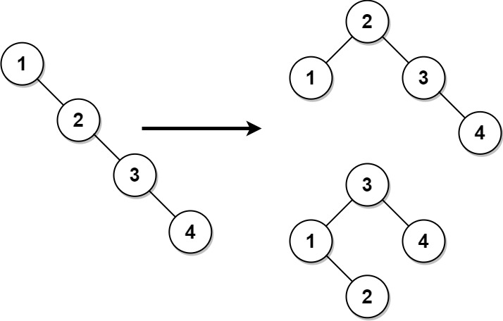

## Balance a Binary Search Tree

Complexidade: Medium  
ID: 1382
Link: https://leetcode.com/problems/balance-a-binary-search-tree/

Dado o root de uma árvore de pesquisa binária, retorno a equilibrado árvore de pesquisa binária com os mesmos valores de nó. Se houver mais de uma resposta, retorne qualquer um deles.

Uma árvore de pesquisa binária é equilibrado se a profundidade das duas subárvores de cada nó nunca diferir em mais de 1.

Exemplo 1:

Entrada: raiz = [1, null, 2, null,3, null,4, null, null]
Saída: [2, 1, 3, null, null, null, 4]
Explicação: Esta não é a única resposta correta, [3, 1, 4, null, 2] também está correta.

Exemplo 2:

Entrada: raiz = [2,1,3]
Saída: [2,1,3]

Restrições:

O número de nós na árvore está no intervalo .[1, 104]
1 <= Node.val <= 105
