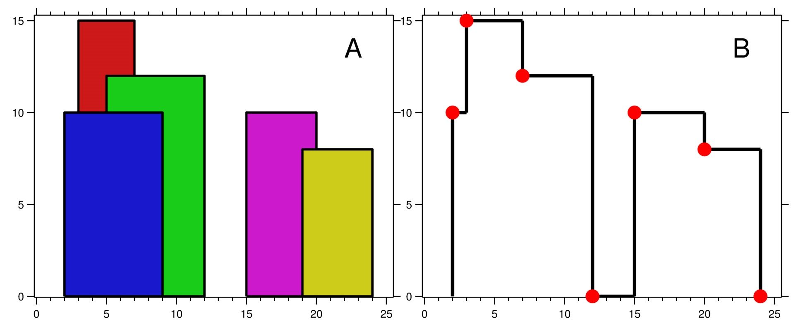

## The Skyline Problem

Topics: Divide and Conquer  
Complexidade: Hard  
ID: 218  
Link: https://leetcode.com/problems/the-skyline-problem/submissions/1678206086/?envType=problem-list-v2&envId=divide-and-conquer

Descrição do Problema
O problema consiste em calcular o skyline (silhueta) de uma cidade formado por edifícios retangulares. Dado um array de edifícios [left, right, height], você deve retornar uma lista de pontos-chave que definem unicamente o skyline.

As informações geométricas de cada edifício são fornecidas na matriz buildings onde buildings[i] = [left_i, right_i, height_i]

- left_i é a coordenada x da borda esquerda do edifício.ith
- right_i é a coordenada x da borda direita do edifício.ith
- height_i é a altura do edifício.ith

Você pode presumir que todos os edifícios são retângulos perfeitos, aterrados em uma superfície absolutamente plana em altura 0.

O horizonte deve ser representado como uma lista de "pontos-chave" classificado por sua coordenada x no formulário . Cada ponto-chave é o ponto final esquerdo de algum segmento horizontal no horizonte, exceto o último ponto da lista, que sempre tem uma coordenada y e é usado para marcar a terminação do horizonte onde termina o edifício mais à direita. Qualquer terreno entre os edifícios mais à esquerda e mais à direita deve fazer parte do contorno do horizonte.[[x1,y1],[x2,y2],...]0

Nota: Não deve haver linhas horizontais consecutivas de igual altura no horizonte de saída. Por exemplo, [...,[2 3],[4 5],[7 5],[11 5],[12 7],...] não é aceitável; as três linhas de altura 5 devem ser fundidas em uma na saída final como tal: [...,[2 3],[4 5],[12 7],...]

Exemplo 1:

Entrada: edifícios = [[2,9,10],[3,7,15],[5,12,12],[15,20,10],[19,24,8]]  
Saída: [[2,10],[3,15],[7,12],[12,0],[15,10],[20,8],[24,0]]

Explicação:  
A Figura A mostra os edifícios da entrada.
A Figura B mostra o horizonte formado por esses edifícios. Os pontos vermelhos na figura B representam os pontos-chave na lista de saída.

Exemplo 2:

- Entrada: edifícios = [[0,2,3],[2,5,3]]
- Saída: [[0,3],[5,0]]

Restrições:

- 1 <= buildings.length <= 104
- 0 <= lefti < righti <= 231 - 1
- 1 <= heighti <= 231 - 1
  buildings é classificado por em ordem não decrescente.lefti
