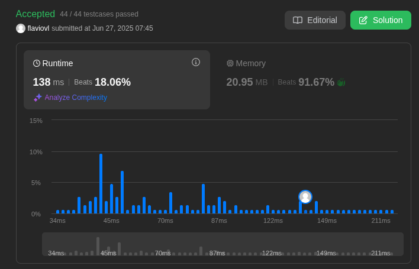
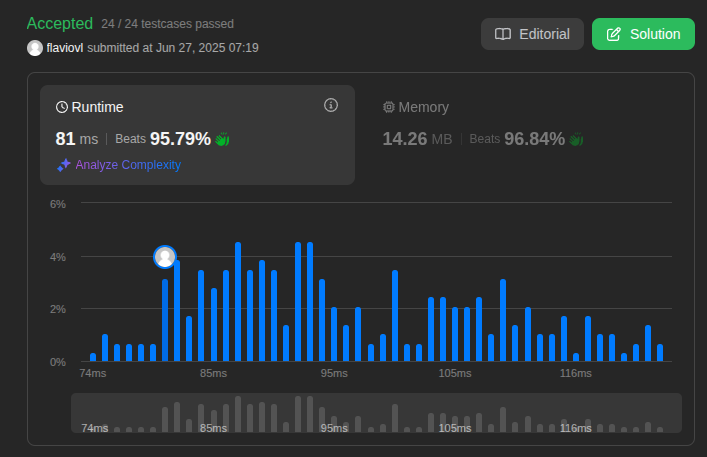
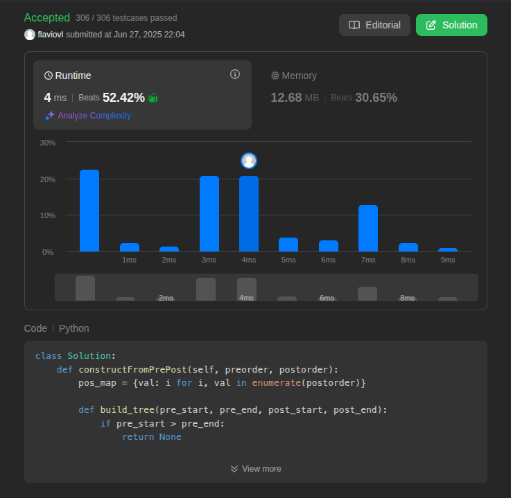
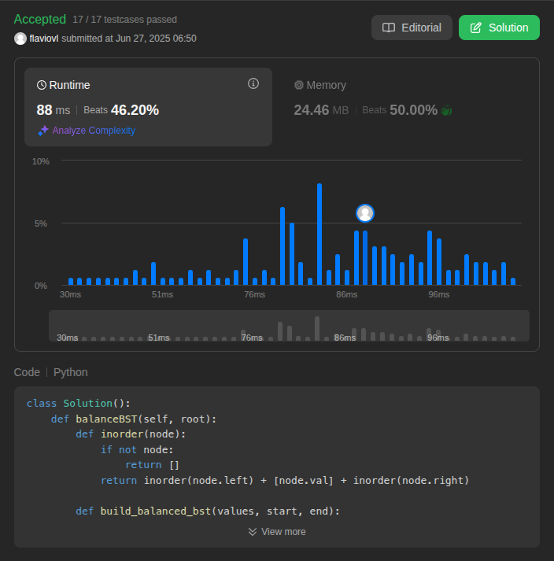

# Resolução de problemas no leetCode

Visão Geral
Este repositório apresenta a resolução de quatro problemas selecionados da plataforma LeetCode, focando na aplicação do paradigma dividir e conquistar. Os problemas foram escolhidos com diferentes níveis de dificuldade para demonstrar a versatilidade desta técnica algorítmica.

**Conteúdo da Disciplina**: Dividir e Conquistar

## Alunos

| Matrícula | Aluno              |
| --------- | ------------------ |
| 150124682 | Flavio Vieira Leao |

### Problemas

| Problema | Descrição                                                                                                                                                                        | Dificuldade |
| -------- | -------------------------------------------------------------------------------------------------------------------------------------------------------------------------------- | ----------- |
| 218      | [The Skyline Problem](https://leetcode.com/problems/the-skyline-problem/submissions/1678786885/)                                                                                 | Hard        |
| 427      | [Construct Quad Tree](https://leetcode.com/problems/construct-quad-tree/submissions/1678786641/)                                                                                 | Medium      |
| 889      | [Construct Binary Tree from Preorder and Postorder Traversal](https://leetcode.com/problems/construct-binary-tree-from-preorder-and-postorder-traversal/submissions/1678786724/) | Medium      |
| 1382     | [Balance a Binary Search Tree](https://leetcode.com/problems/balance-a-binary-search-tree/submissions/1678787377/)                                                               | Medium      |

[Link para o video de apresentação]()

## Screenshots

Questão 218: The Skyline Problem

Questão 427: Construct Quad Tree

Questão 889: Construct Binary Tree from Preorder and Postorder Traversal

Questão 1382: Balance a Binary Search Tree

Instalação
Linguagem: Python

Uso
Para executar os códigos, é recomendado clicar no link do problema que direciona para o LeetCode e rodar o código diretamente na plataforma.
